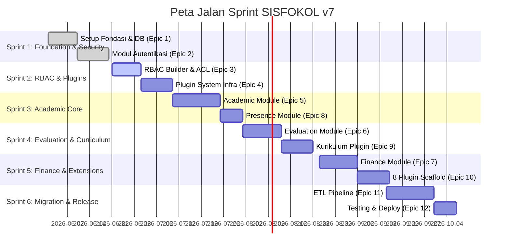

# DEV_DOCS-017: Sprint Plan — Pembagian Epic & Peta Jalan Eksekusi

- **Tanggal:** 2026-06-21 08:05
- **Status:** 🚀 AKTIF (Sprint 1 Selesai, Memulai Sprint 2)
- **Penulis:** Antigravity (Google DeepMind)
- **Proyek:** Konversi SISFOKOL v7 (PHP native) → Laravel 11 modular monolith

---

## ⚡ EXECUTIVE SUMMARY
Untuk menjaga efisiensi pengembangan dan memastikan integrasi berkelanjutan (*continuous integration*), 12 Epic dalam proyek migrasi SISFOKOL v7 dibagi ke dalam **6 Sprint Taktis**. Setiap sprint direncanakan berjalan secara berurutan dengan target deliverable yang jelas dan dapat diuji.

---

## 📂 DAFTAR SPRINT & DETAIL EKSEKUSI

### 🏃‍♂️ Sprint 1: Foundation & Security Gateways
- **Fokus Utama**: Menyiapkan pondasi proyek modular monolith, koneksi database ganda (sistem baru & legacy untuk ETL), enkapsulasi konteks multi-tenant, dan modul autentikasi utama (login throttling, audit log, force password reset, dan impersonation).
- **Epic Terkait**:
  - **Epic 1**: Setup + Fondasi (Tenancy & Base Configuration)
  - **Epic 2**: Auth Module Full (Login, Impersonation, Audit Trails)
- **Deliverables**:
  - Kerangka aplikasi Laravel 11 modular monolith aktif.
  - Multi-tenant global scope aktif (isolasi data aman).
  - Layanan impersonation aman dengan perlindungan mutasi rute sensitif.
  - Pengujian otomatis hijau (40 pengujian lulus).
- **Status**: ✅ **SELESAI (100%)**

---

### 🏃‍♂️ Sprint 2: Dynamic RBAC & Extension Infrastructure
- **Fokus Utama**: Membangun mekanisme otorisasi dinamis tingkat lanjut (visibilitas menu & field ACL) dan infrastruktur sistem plugin agar fitur tambahan dapat dinyalakan/dimatikan secara dinamis per tenant.
- **Epic Terkait**:
  - **Epic 3**: RBAC Builder + Field ACL + Menu Renderer
  - **Epic 4**: Plugin System Infrastructure
- **Deliverables**:
  - Menu navigasi sidebar dinamis dikendalikan oleh database.
  - Direktif Blade `@field` dan `@fieldAttr` untuk proteksi data sensitif dari eksploitasi DOM.
  - Halaman antarmuka RBAC Builder 4-tab interaktif (UI Tailwind CSS premium).
  - Logika register, load, dan isolasi aset untuk modul-modul eksternal (Plugins).
- **Status**: ⏳ **SIAP MULAI (Sprint Aktif Berikutnya)**

---

### 🏃‍♂️ Sprint 3: Core Academic & Presence Domains
- **Fokus Utama**: Mengimplementasikan entitas inti sekolah yang meliputi data siswa, guru, kelas, mata pelajaran, jadwal pelajaran, hingga perekaman presensi harian serta per jam mata pelajaran.
- **Epic Terkait**:
  - **Epic 5**: Academic Module (Mengelola 11 tabel inti)
  - **Epic 8**: Presence Module (Mengelola 3 tabel kehadiran)
- **Deliverables**:
  - CRUD & manajemen relasi untuk Siswa, Guru, Ruangan, Kelas, dan Jadwal Pelajaran.
  - Fitur penjadwalan konflik-free.
  - UI perekaman kehadiran harian dan kehadiran berbasis jam pelajaran (untuk Guru & Siswa).
- **Status**: ⏳ **PENDING**

---

### 🏃‍♂️ Sprint 4: Evaluation & Curriculum Framework
- **Fokus Utama**: Mengimplementasikan sistem penilaian siswa (formatif, sumatif, proyek profil pancasila) dan modul kurikulum merdeka/nasional sebagai modul plugin referensi utama.
- **Epic Terkait**:
  - **Epic 6**: Evaluation Module (Mengelola 7 tabel nilai & rapor)
  - **Epic 9**: Plugin Kurikulum (Referensi implementasi plugin Fase 1)
- **Deliverables**:
  - Form entri nilai formatif & sumatif per mata pelajaran.
  - Mesin penghitung nilai rapor akhir otomatis.
  - Format cetak rapor PDF (DomPDF) sesuai aturan kementerian.
  - Integrasi plugin kurikulum yang mendemonstrasikan contract/interface plugin.
- **Status**: ⏳ **PENDING**

---

### 🏃‍♂️ Sprint 5: School Finance & Extended Plugins
- **Fokus Utama**: Membangun modul keuangan sekolah yang sangat sensitif (pembayaran SPP, tunggakan, tabungan siswa) dengan proteksi race condition, serta men-scaffold 8 plugin pelengkap lainnya.
- **Epic Terkait**:
  - **Epic 7**: Finance Module (Mengelola 5 tabel keuangan dengan transaksi ketat)
  - **Epic 10**: 8 Plugin Scaffold (Rapor, SPP, PPDB, Perpus, BK, dll.)
- **Deliverables**:
  - `PembayaranService` dengan perlindungan `DB::transaction` + `lockForUpdate()`.
  - Sistem pencatatan tabungan dan tunggakan tagihan siswa secara real-time.
  - Struktur boilerplate (scaffold) untuk 8 modul plugin tambahan agar siap dikembangkan di masa mendatang.
- **Status**: ⏳ **PENDING**

---

### 🏃‍♂️ Sprint 6: Data Migration, Verification & Production Release
- **Fokus Utama**: Menjalankan pipa ETL (Extract, Transform, Load) untuk menarik data dari database SISFOKOL v7 legacy (MyISAM) ke database baru (InnoDB), melakukan pengujian skala penuh, dan optimasi performa siap rilis.
- **Epic Terkait**:
  - **Epic 11**: ETL Pipeline (20 tahapan konversi data legacy)
  - **Epic 12**: Testing + Deployment (Uji akhir & kesiapan server)
- **Deliverables**:
  - Script ETL command artisan yang dapat memigrasi ribuan data historis siswa, guru, nilai, dan keuangan tanpa kehilangan integritas data.
  - Validasi kecocokan data pasca-migrasi (*data reconciliation*).
  - Pemuatan optimalisasi database (indeks & query tuning).
  - Sistem siap dideploy ke server produksi Laragon/Apache.
- **Status**: ⏳ **PENDING**

---

## 🔄 TRANSISI CHECKLIST (MENUJU SPRINT 2)

Sebelum memulai pengerjaan kode pada Sprint 2, pastikan langkah berikut telah terpenuhi:
1. [x] Seluruh pengujian otomatis dari Sprint 1 berstatus **PASS** (100% hijau).
2. [x] Dokumen Rencana Implementasi Epic 3 disimpan di [DEV_DOCS-016](file:///d:/laragon/www/sisfokolv7/DEV_DOCS/016_implementation_plan_epic_3_20260621_0805.md).
3. [x] Pengguna menyetujui pembagian sprint ini dan rencana implementasi Epic 3.
