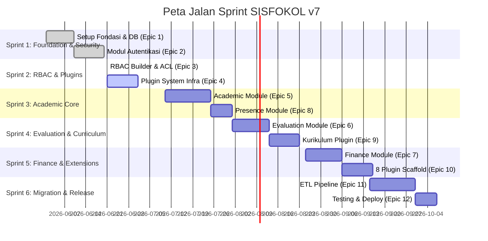

# DEV_DOCS-021: Sprint Plan — Pembagian Epic & Peta Jalan Eksekusi (Updated 08:31)

- **Tanggal:** 2026-06-21 08:31
- **Status:** 🚀 AKTIF (Sprint 2 Sedang Berjalan)
- **Penulis:** Antigravity (Google DeepMind)
- **Proyek:** Konversi SISFOKOL v7 (PHP native) → Laravel 11 modular monolith

---

## ⚡ EXECUTIVE SUMMARY
Untuk menjaga efisiensi pengembangan dan memastikan integrasi berkelanjutan (*continuous integration*), 12 Epic dalam proyek migrasi SISFOKOL v7 dibagi ke dalam **6 Sprint Taktis**.

Update Terkini (08:31):
- **Sprint 1 (Epic 1 & 2)**: Selesai 100%.
- **Sprint 2 (Epic 3 & 4)**:
  - Epic 3 (RBAC Builder & ACL) **SELESAI 100%** (Diverifikasi dengan 51 pengujian hijau). Walkthrough disimpan di [DEV_DOCS-018](file:///d:/laragon/www/sisfokolv7/DEV_DOCS/018_walkthrough_epic_3_rbac_builder_20260621_0831.md).
  - Epic 4 (Plugin System Infrastructure) **SIAP DIMULAI**. Rencana implementasi disimpan di [DEV_DOCS-019](file:///d:/laragon/www/sisfokolv7/DEV_DOCS/019_implementation_plan_epic_4_20260621_0828.md).

---

## 📂 DAFTAR SPRINT & DETAIL EKSEKUSI

### 🏃‍♂️ Sprint 1: Foundation & Security Gateways
- **Epic Terkait**:
  - **Epic 1**: Setup + Fondasi (Tenancy & Base Configuration)
  - **Epic 2**: Auth Module Full (Login, Impersonation, Audit Trails)
- **Status**: ✅ **SELESAI (100%)**

---

### 🏃‍♂️ Sprint 2: Dynamic RBAC & Extension Infrastructure
- **Epic Terkait**:
  - **Epic 3**: RBAC Builder + Field ACL + Menu Renderer
    - **Status**: ✅ **SELESAI (100%)** (Diverifikasi dengan 11 pengujian otomatis tambahan, total 51 pengujian hijau). Walkthrough disimpan di [018_walkthrough_epic_3_rbac_builder_20260621_0831.md](file:///d:/laragon/www/sisfokolv7/DEV_DOCS/018_walkthrough_epic_3_rbac_builder_20260621_0831.md).
  - **Epic 4**: Plugin System Infrastructure
    - **Status**: ⏳ **SIAP MULAI (Epic Aktif Berikutnya)**
- **Deliverables Epic 4**:
  - `PluginContract` interface dan `PluginContext` bootstrapper.
  - Discovery otomatis folder `app/Plugins/*` dengan `PluginRegistry`.
  - Filter akses dengan middleware `EnsurePluginEnabled` (alias `plugin:kode`).
  - `PluginActivationService` dengan dynamic permission seeding dan audit trail log.
  - Tampilan dashboard card premium Tailwind CSS untuk manajemen plugin.

---

### 🏃‍♂️ Sprint 3: Core Academic & Presence Domains
- **Epic Terkait**:
  - **Epic 5**: Academic Module (Mengelola 11 tabel inti)
  - **Epic 8**: Presence Module (Mengelola 3 tabel kehadiran)
- **Status**: ⏳ **PENDING**

---

### 🏃‍♂️ Sprint 4: Evaluation & Curriculum Framework
- **Epic Terkait**:
  - **Epic 6**: Evaluation Module (Mengelola 7 tabel nilai & rapor)
  - **Epic 9**: Plugin Kurikulum (Referensi implementasi plugin Fase 1)
- **Status**: ⏳ **PENDING**

---

### 🏃‍♂️ Sprint 5: School Finance & Extended Plugins
- **Epic Terkait**:
  - **Epic 7**: Finance Module (Mengelola 5 tabel keuangan dengan transaksi ketat)
  - **Epic 10**: 8 Plugin Scaffold (Boilerplate untuk modul tambahan)
- **Status**: ⏳ **PENDING**

---

### 🏃‍♂️ Sprint 6: Data Migration, Verification & Production Release
- **Epic Terkait**:
  - **Epic 11**: ETL Pipeline (20 tahapan konversi data legacy)
  - **Epic 12**: Testing + Deployment (Uji akhir & kesiapan server)
- **Status**: ⏳ **PENDING**

---

## 🔄 TRANSISI CHECKLIST (MENUJU EPIC 4)

Sebelum memulai pengerjaan kode pada Epic 4, pastikan langkah berikut telah terpenuhi:
1. [x] Seluruh pengujian otomatis dari Epic 1 s.d 3 berstatus **PASS** (51 pengujian hijau).
2. [x] Dokumen Rencana Implementasi Epic 4 disimpan di [DEV_DOCS-019](file:///d:/laragon/www/sisfokolv7/DEV_DOCS/019_implementation_plan_epic_4_20260621_0828.md).
3. [x] Pengguna menyetujui pembagian sprint terbaru ini dan rencana implementasi Epic 4.
