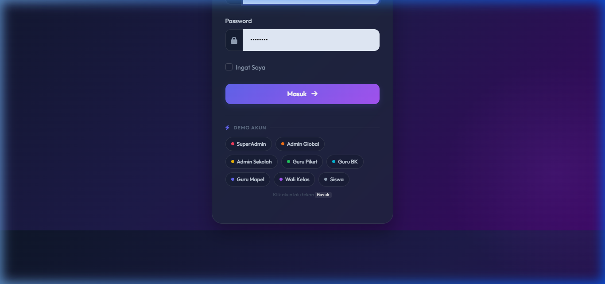
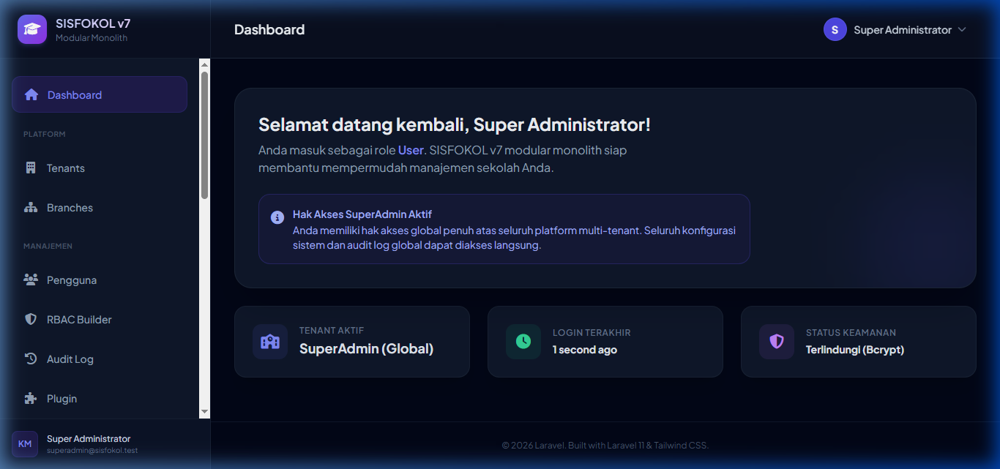
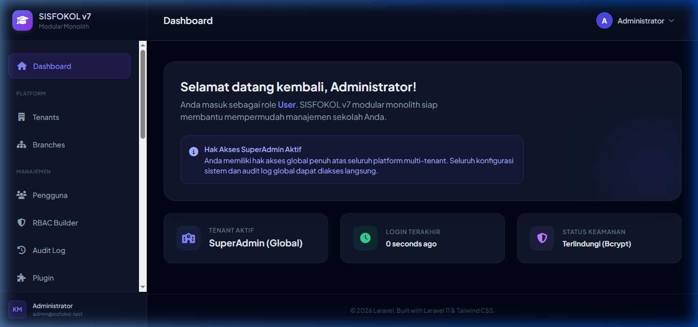
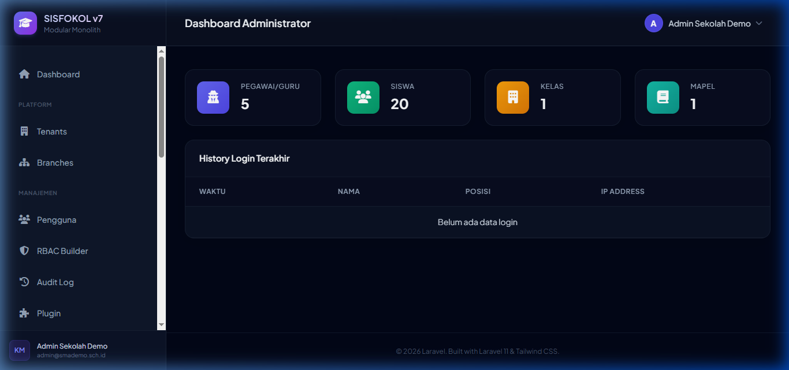
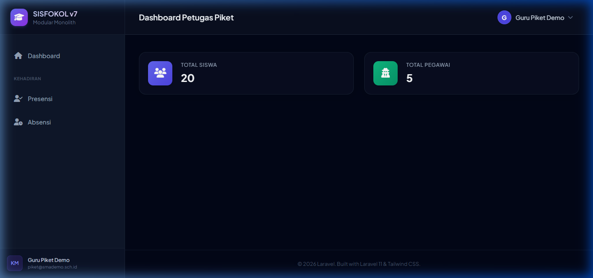
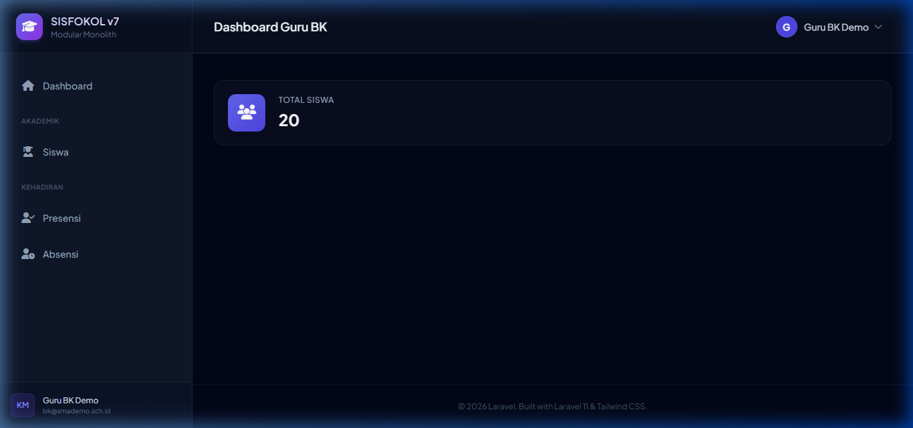
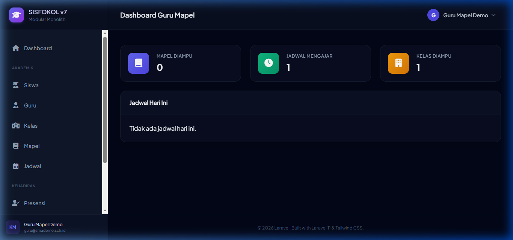
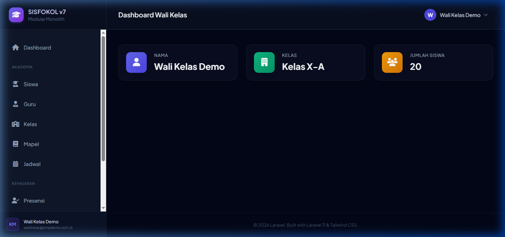
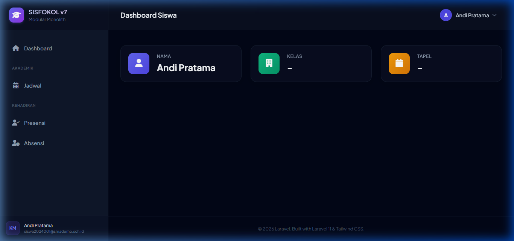

# Dev Report 054 — Browser Login Test: Demo Quick Login Panel

**Tanggal:** 2026-06-25  
**Waktu:** 07:38 – 07:52 WIB  
**Developer:** AI Assistant (Antigravity)  
**Scope:** Feature — Quick Login Demo Panel + Browser Verification  

---

## 1. Latar Belakang

Fitur **Demo Quick Login Panel** ditambahkan ke halaman login agar developer dapat dengan cepat berpindah antar role tanpa mengetik kredensial secara manual. Setelah implementasi, dilakukan browser test manual untuk memverifikasi semua 8 akun demo dapat login dan diarahkan ke dashboard yang tepat.

---

## 2. Perubahan yang Diimplementasikan

**File:** `sisfokol-laravel/resources/views/auth/login.blade.php`

| Aspek | Detail |
|---|---|
| Guard environment | `@if(config('app.env') === 'local')` — panel **hanya tampil di `local`**, tidak di production |
| Jumlah chip | 8 chip (satu per role) |
| Warna chip | Color-coded per role (merah=superadmin, oranye=admin, dst.) |
| Mekanisme | Klik chip → auto-fill `username` + `password` → submit otomatis (delay 280ms) |
| Form ID | `id="loginForm"` ditambahkan ke `<form>` |
| JS function | `quickLogin(username, password, chipId)` |

---

## 3. Halaman Login — Demo Panel



---

## 4. Hasil Browser Test

### ✅ 8/8 Akun Berhasil Login

| # | Role | Username | Password | URL Setelah Login | Status |
|---|---|---|---|---|---|
| 1 | SuperAdmin | `superadmin` | `SuperAdmin#2026` | `/dashboard` | ✅ |
| 2 | Admin Global | `admin` | `password` | `/dashboard` | ✅ |
| 3 | Admin Sekolah | `admin.sekolah` | `demo1234` | `/admin/dashboard` | ✅ |
| 4 | Guru Piket | `piket.demo` | `demo1234` | `/picket/dashboard` | ✅ |
| 5 | Guru BK | `bk.demo` | `demo1234` | `/counselor/dashboard` | ✅ |
| 6 | Guru Mapel | `guru.demo` | `demo1234` | `/teacher/dashboard` | ✅ |
| 7 | Wali Kelas | `walikelas.demo` | `demo1234` | `/homeroom/dashboard` | ✅ |
| 8 | Siswa | `siswa.2024001` | `demo1234` | `/student/dashboard` | ✅ |

---

## 5. Screenshots Dashboard per Role

### SuperAdmin



### Admin Global



### Admin Sekolah



### Guru Piket



### Guru BK



### Guru Mapel



### Wali Kelas



### Siswa



---

## 6. Verifikasi Database

```bash
php83 artisan tinker --execute="echo json_encode(DB::table('users')->whereIn('username', [
  'superadmin','admin','admin.sekolah','piket.demo',
  'bk.demo','guru.demo','walikelas.demo','siswa.2024001'
])->get(['id','username','tipe','aktif'])->toArray(), JSON_PRETTY_PRINT);"
```

**Hasil:**

| ID | Username | Tipe | Aktif |
|---|---|---|---|
| 1 | `superadmin` | super_admin | ✅ |
| 2 | `admin` | admin_sekolah | ✅ |
| 3 | `admin.sekolah` | admin_sekolah | ✅ |
| 4 | `piket.demo` | pegawai | ✅ |
| 5 | `bk.demo` | pegawai | ✅ |
| 6 | `guru.demo` | pegawai | ✅ |
| 7 | `walikelas.demo` | pegawai | ✅ |
| 8 | `siswa.2024001` | siswa | ✅ |

---

## 7. Cara Reset Data Demo

Jika data demo terhapus (misalnya setelah test suite `RefreshDatabase`), jalankan:

```bash
php83 artisan migrate:fresh --seed
```

Urutan seeder yang dijalankan:
1. `RolePermissionSeeder` — roles & permissions Spatie
2. `SuperAdminSeeder` — user superadmin
3. `SchoolProfileSeeder`, `AcademicYearSeeder`, `DaySeeder`, dll — data master
4. `UserSeeder` — user admin global
5. **`DemoSeeder`** — 8 akun demo + tenant SMA Demo Sisfokol (NPSN: 20000001)

---

## 8. Catatan

- Panel demo **tidak akan terlihat di production** (guard `APP_ENV=local`).
- Untuk menambah akun demo baru, edit `database/seeders/DemoSeeder.php`.
- Recording video test tersimpan di folder artifacts Antigravity IDE.

---

*Laporan ini dibuat oleh AI Assistant Antigravity — 2026-06-25*
