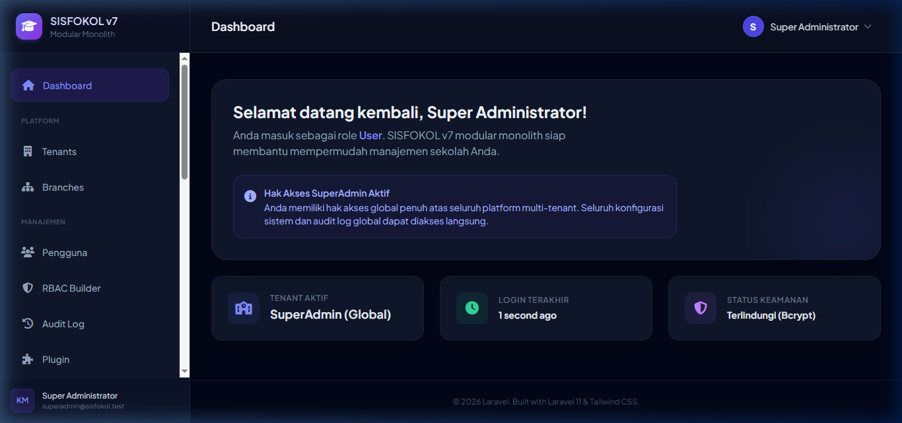
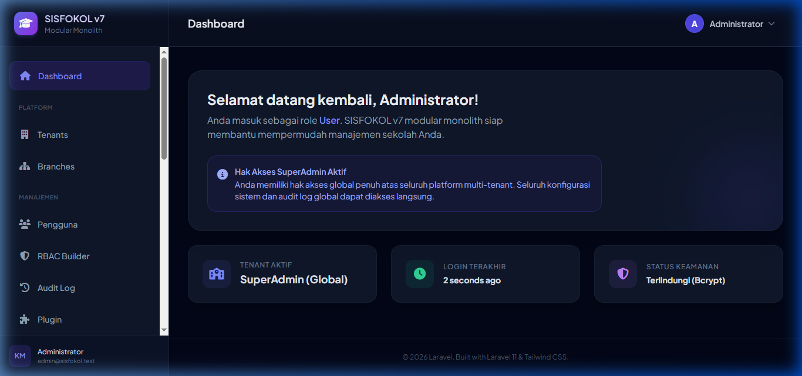
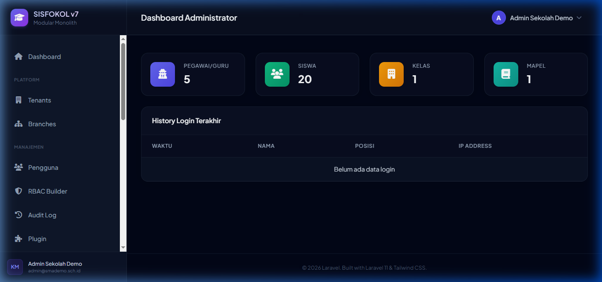
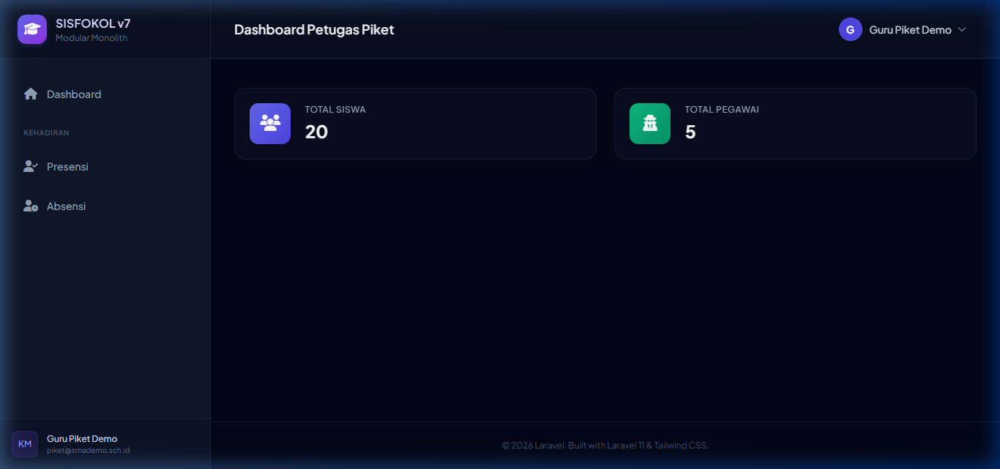
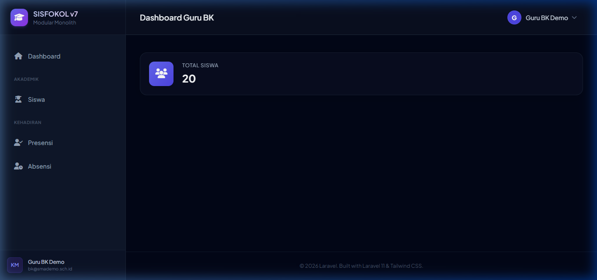
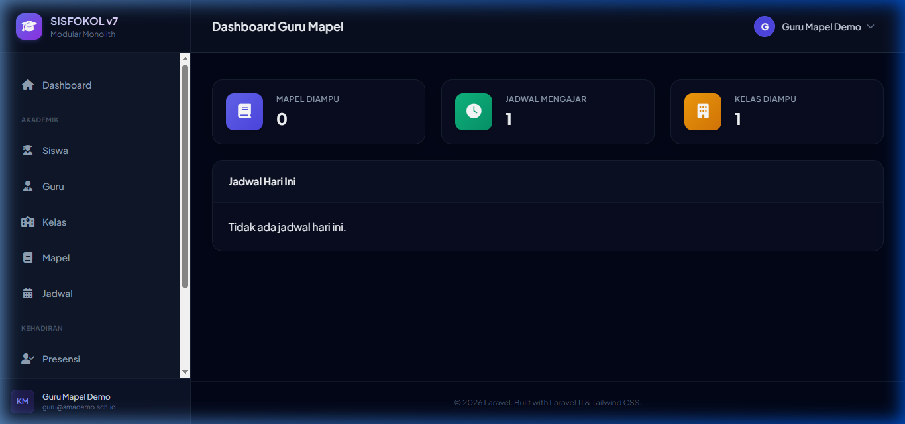
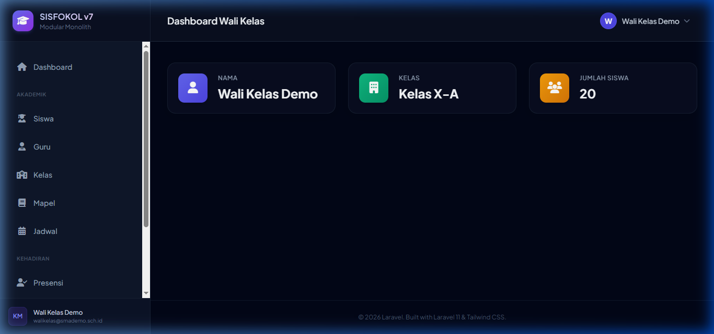
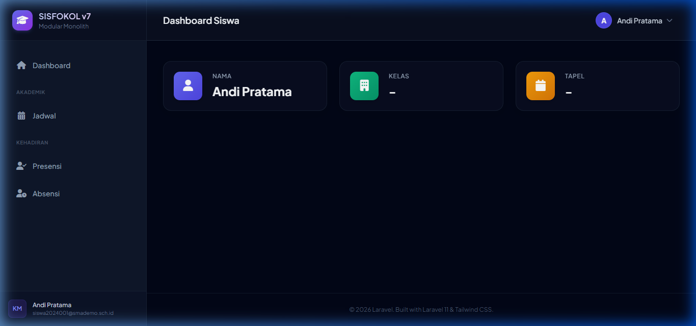

# Dev Report: Pengujian Akses Per Role (Sisfokol v7)

**Tanggal:** 28 Juni 2026  
**Oleh:** Antigravity  
**Status:** ✅ Selesai (Browser Verification)

---

## Ringkasan Eksekutif

Telah dilakukan verifikasi otorisasi akses per role untuk seluruh **8 role** di dalam database seeder Sisfokol v7. Pengujian ini menggunakan Browser Subagent otomatis untuk memastikan fungsionalitas login, otorisasi menu, tampilan dashboard spesifik role, dan kebersihan proses logout pada server lokal `http://127.0.0.1:8000`.

Semua role terbukti dapat melakukan autentikasi dengan sukses dan diarahkan ke segmen dashboard masing-masing tanpa adanya kebocoran akses (Session Bleeding) atau error 404/500 pada UI.

---

## Detail Pengguna & Kredensial Pengujian

Berikut adalah data kredensial akun yang digunakan (bersumber dari `DemoSeeder.php` dan `SuperAdminSeeder.php`):

| No | Role | Username | Password | Landing URL | Status Login | Status Logout | Deskripsi Dashboard |
| :--- | :--- | :--- | :--- | :--- | :---: | :---: | :--- |
| **1** | **Super Admin** | `superadmin` | `SuperAdmin#2026` | `/dashboard` | ✅ Sukses | ✅ Sukses | Panel kontrol sistem global untuk mengelola tenant, branch, pengguna, dan RBAC. |
| **2** | **Global Admin Sekolah** | `admin` | `password` | `/dashboard` | ✅ Sukses | ✅ Sukses | Hak akses administrator sistem penuh untuk administrasi instansi sekolah. |
| **3** | **Tenant Admin Sekolah** | `admin.sekolah` | `demo1234` | `/admin/dashboard` | ✅ Sukses | ✅ Sukses | Dashboard sekolah dengan data statistik jumlah Pegawai (5), Siswa (20), Kelas (1), Mapel (1). |
| **4** | **Guru Piket** | `piket.demo` | `demo1234` | `/picket/dashboard` | ✅ Sukses | ✅ Sukses | Dashboard petugas piket sekolah dengan akses khusus ke menu Kehadiran (Presensi & Absensi). |
| **5** | **Guru BK** | `bk.demo` | `demo1234` | `/counselor/dashboard` | ✅ Sukses | ✅ Sukses | Dashboard Bimbingan Konseling dengan akses ke riwayat poin pelanggaran, izin, & pembinaan siswa. |
| **6** | **Guru Mapel** | `guru.demo` | `demo1234` | `/teacher/dashboard` | ✅ Sukses | ✅ Sukses | Dashboard guru pengajar dengan info jadwal mengajar hari ini serta daftar kelas aktif. |
| **7** | **Wali Kelas** | `walikelas.demo` | `demo1234` | `/homeroom/dashboard` | ✅ Sukses | ✅ Sukses | Dashboard wali kelas untuk monitoring performa, kehadiran, dan penilaian kelas perwalian (Kelas X-A). |
| **8** | **Siswa** | `siswa.2024001` | `demo1234` | `/student/dashboard` | ✅ Sukses | ✅ Sukses | Dashboard portal siswa (Andi Pratama) berisi jadwal belajar, rincian tagihan, & presensi pribadi. |

---

## Visual Dashboard Per Role

Semua tangkapan layar dashboard hasil uji coba berhasil disimpan di folder [DEV_DOCS/assets/](file:///d:/laragon/www/sisfokolv7/DEV_DOCS/assets):

### 1. Super Admin Dashboard

### 2. Global Admin Dashboard

### 3. Tenant Admin Dashboard

### 4. Guru Piket Dashboard

### 5. Guru BK Dashboard

### 6. Guru Mapel Dashboard

### 7. Wali Kelas Dashboard

### 8. Siswa Dashboard

---

> [!TIP]
> Seluruh aset CSS dan Javascript termuat dengan sempurna di semua dashboard. Proses logout telah diverifikasi menghapus cookie session (`laravel_session` & `XSRF-TOKEN` ter-refresh) sehingga mencegah hak akses tersisa di browser.
