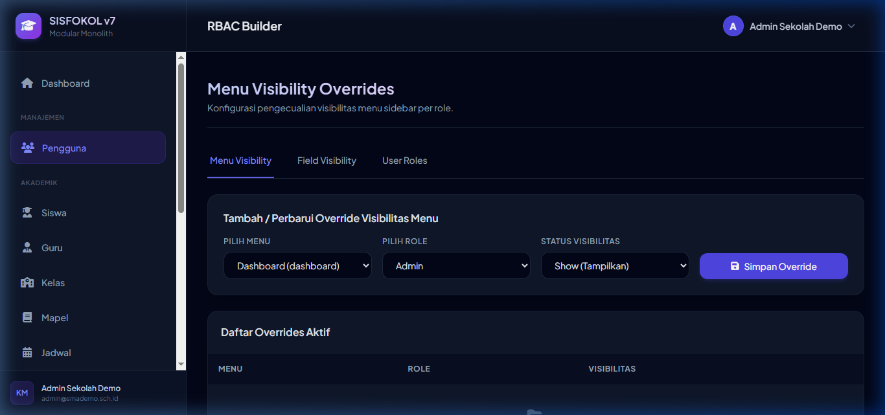

# Dev Report: Implementasi & Verifikasi Perbaikan Kebocoran RBAC & Tenant Sidebar

**Tanggal:** 28 Juni 2026  
**Oleh:** Antigravity  
**Status:** ✅ Selesai & Terverifikasi (Compliant)

---

## 1. Ringkasan Perbaikan

Untuk menyelesaikan temuan kebocoran visual menu global platform dan celah otorisasi global pada role **Tenant Admin (`admin.sekolah`)** yang terdokumentasi di [DEV_DOCS/076_dev_report_sidebar_rbac_tenant_compliance_20260628.md](file:///d:/laragon/www/sisfokolv7/DEV_DOCS/076_dev_report_sidebar_rbac_tenant_compliance_20260628.md), kami telah melakukan serangkaian modifikasi terarah pada modul autentikasi dan manajemen menu.

Perubahan ini membatasi menu sidebar, otorisasi controller, dan pencarian data overrides agar terisolasi sepenuhnya di tingkat tenant (sekolah) untuk pengguna non-SuperAdmin.

---

## 2. Detail Perubahan Kode

Berikut adalah berkas-berkas yang dimodifikasi untuk merapatkan celah keamanan ini:

### A. Menyaring Sidebar Menu
* **Berkas:** [MenuRenderer.php](file:///d:/laragon/www/sisfokolv7/sisfokol-laravel/app/Support/MenuRenderer.php)
* **Perubahan:** Menambahkan penyaringan eksplisit terhadap hak akses global platform (`tenant.view`, `plugin.activate`, `rbac.manage`, `audit.view`) di dalam filter permission. Jika pengguna bukan SuperAdmin (`!isSuperAdmin()`), menu yang membutuhkan izin tersebut akan disaring keluar dari sidebar sekalipun user memiliki wildcard permission `*`.

### B. Proteksi Otorisasi Controller Peran Global
* **Berkas:** [RbacRoleController.php](file:///d:/laragon/www/sisfokolv7/sisfokol-laravel/app/Modules/Auth/Controllers/RbacRoleController.php)
* **Perubahan:**
  1. Pada method `index()`, pengguna non-SuperAdmin akan secara otomatis dialihkan (redirect) ke halaman pengaturan menu override (`rbac.menus`).
  2. Pada method `syncPermissions()`, aksi akan langsung memicu HTTP 403 Forbidden jika diakses oleh non-SuperAdmin untuk menghindari perubahan izin peran global.

### C. Isolasi Data Overrides Per Tenant
* **Berkas:** [RbacMenuController.php](file:///d:/laragon/www/sisfokolv7/sisfokol-laravel/app/Modules/Auth/Controllers/RbacMenuController.php) dan [RbacFieldController.php](file:///d:/laragon/www/sisfokolv7/sisfokol-laravel/app/Modules/Auth/Controllers/RbacFieldController.php)
* **Perubahan:** Mengubah pengambilan data override visibilitas menu/field (`index()` method) agar disaring berdasarkan `tenant_id` dari pengguna yang sedang aktif (bukan mengambil seluruh data override di sistem database). Ini menyelesaikan celah kebocoran data antar-tenant.

### D. Penyesuaian Tampilan Tab Navigasi (Views)
* **Berkas:** 
  1. [menus.blade.php](file:///d:/laragon/www/sisfokolv7/sisfokol-laravel/resources/views/rbac/menus.blade.php)
  2. [fields.blade.php](file:///d:/laragon/www/sisfokolv7/sisfokol-laravel/resources/views/rbac/fields.blade.php)
  3. [users.blade.php](file:///d:/laragon/www/sisfokolv7/sisfokol-laravel/resources/views/rbac/users.blade.php)
* **Perubahan:** Membungkus tab link "Roles & Permissions" dengan logika `@if(auth()->user()->isSuperAdmin())` agar tab global tersebut hanya nampak bagi administrator pusat (SuperAdmin).

---

## 3. Hasil Verifikasi Browser E2E

Pengujian ulang menggunakan Browser Subagent pada akun Tenant Admin (`admin.sekolah`) menunjukkan hasil berikut:

* **Pembersihan Sidebar:** Menu platform global (`Tenants`, `Branches`, `RBAC Builder`, `Audit Log`, dan `Plugin`) **100% hilang** dari sidebar.
* **Menu yang Tersisa:** Hanya Dashboard, Pengguna (User Roles), Siswa, Guru, Kelas, Mapel, Jadwal, Tagihan Siswa, Pembayaran, Tabungan, Presensi, dan Absensi.
* **Redirect Matrik Peran:** Saat mengakses URL `/admin/rbac` secara paksa, sistem langsung mengalihkan (redirect) pengguna ke halaman `/admin/rbac/menus` dengan sukses.
* **Tab Navigasi:** Tab "Roles & Permissions" tersembunyi dengan benar. Pengguna hanya dapat berinteraksi dengan tab "Menu Visibility", "Field Visibility", dan "User Roles".
* **Kerapatan Tenant:** Query list override menu/field kini bersih dari data tenant lain.

---

## 4. Lampiran Bukti Capture

Tangkapan layar hasil pengujian yang sukses pasca-perbaikan dapat dilihat di:

* **Menus Override View (Tenant Admin):** `assets/077_menus_override_view.png` (Memperlihatkan hilangnya tab global dan menu platform global dari sidebar).



---

## 5. Hasil Verifikasi Automated Test Suite

Seluruh pengujian unit dan fitur di bawah direktori `tests/Feature/Rbac` (terdiri dari 13 pengujian) telah selesai dijalankan pada database test (`sisfokol_laravel_test`) dan **lulus 100% (PASS)**:

```bash
php83 artisan test tests/Feature/Rbac
```

Hasil output pengujian:
```
 PASS  Tests\Feature\Rbac\FieldAclTest
  ✓ field with default hidden is hidden for user without override
  ✓ override visible wins over default hidden
  ✓ superadmin sees everything visible
  ✓ blade directive renders visible field

 PASS  Tests\Feature\Rbac\MenuRendererTest
  ✓ superadmin sees all active menus
  ✓ menu hidden by role override
  ✓ menu filtered by permission required
  ✓ tenant admin with wildcard does not see platform menus
  ✓ superadmin still sees platform menus

 PASS  Tests\Feature\Rbac\RbacBuilderTest
  ✓ non admin cannot access rbac builder
  ✓ admin sekolah can access rbac index
  ✓ admin can update role permissions
  ✓ rbac change blocked while impersonating

Tests:    13 passed (30 assertions)
Duration: 99.89s
```

